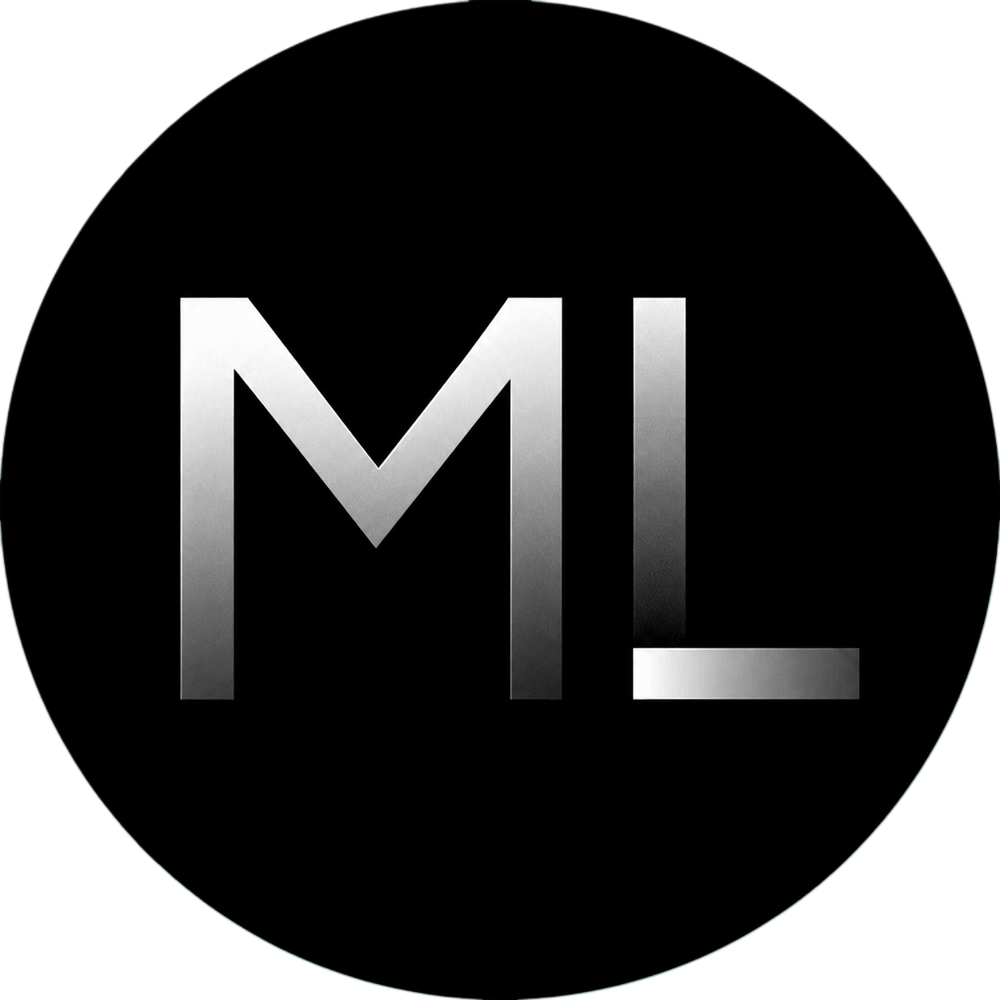
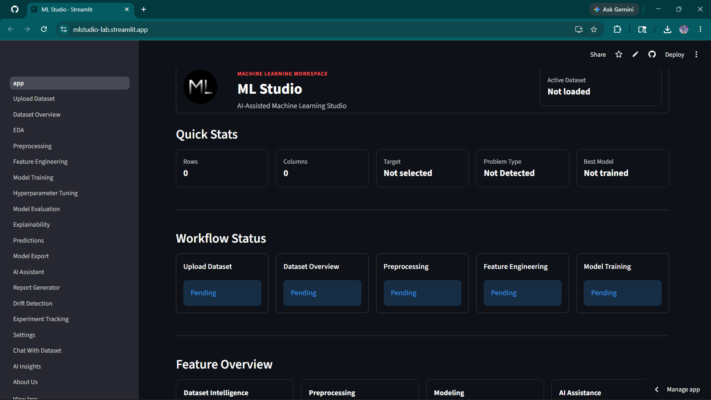
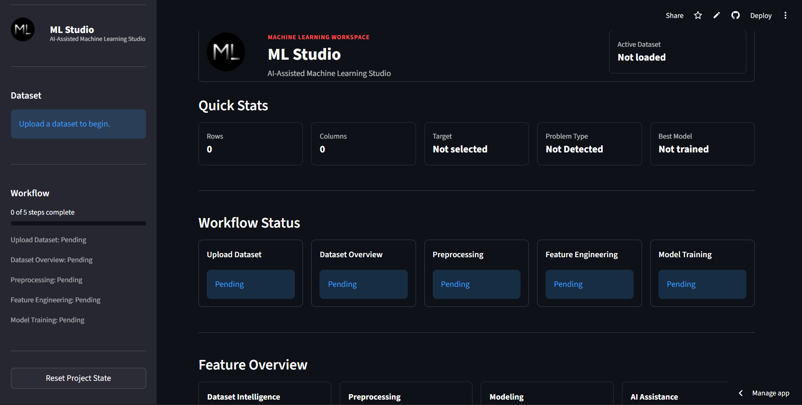
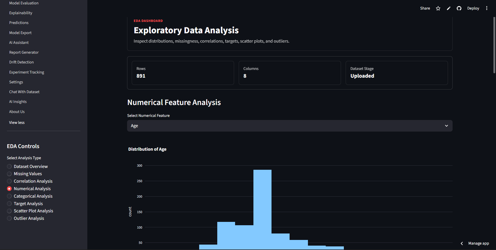
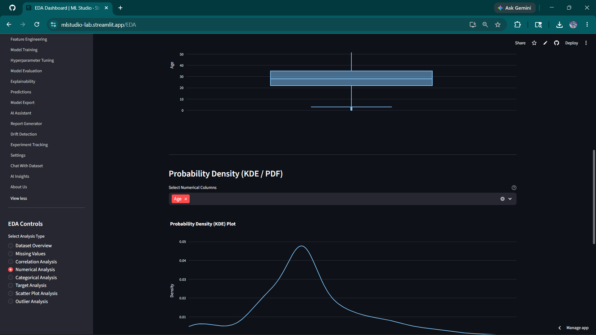
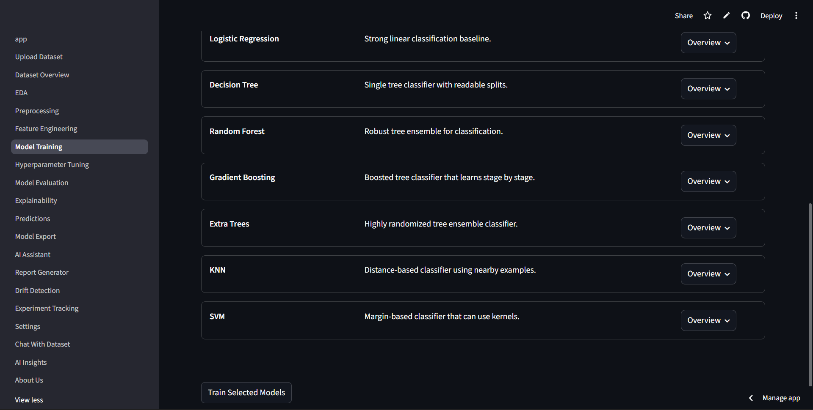
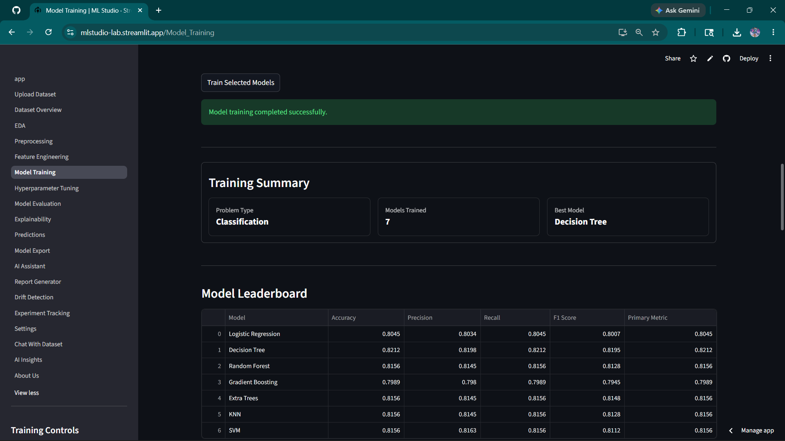
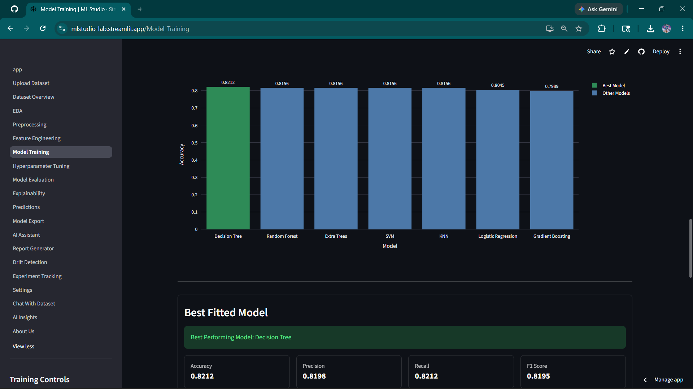
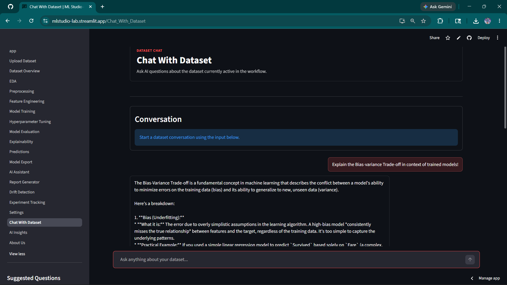

# 🚀 ML Studio — AI-Assisted AutoML Platform

<p align="center">
  
</p>

<p align="center">
  <b>A modular Streamlit-based AutoML platform for intelligent machine learning workflows.</b>
</p>

<p align="center">


</p>

---

# 📌 Overview

ML Studio is a professional AutoML platform built using **Streamlit**, designed to simplify and automate the complete machine learning workflow.

It enables users to:

* Upload and analyze datasets
* Perform intelligent preprocessing
* Apply feature engineering
* Train multiple ML models
* Tune hyperparameters
* Generate explainability reports
* Predict using trained models
* Detect data drift
* Generate AI-powered insights
* Track experiments and export models

The platform is designed for:

* 📊 Data Analysts
* 🤖 Machine Learning Enthusiasts
* 🎓 Students & Researchers
* 🧠 AI Learners
* 🚀 Portfolio & Showcase Projects

---

# ✨ Features

## 📂 Dataset Upload & Validation

* Upload CSV datasets
* Automatic datatype detection
* Dataset health checks
* Missing value detection
* Duplicate row analysis

---

## 📊 Exploratory Data Analysis (EDA)

* Correlation analysis
* Distribution plots
* Skewness analysis
* Outlier visualization
* Statistical summaries

---

## 🧹 Intelligent Preprocessing

* Missing value handling
* Column-wise preprocessing controls
* Encoding techniques
* Feature scaling
* Duplicate row handling

---

## 🛠 Feature Engineering

* Log transformations
* Feature generation
* AI-powered feature recommendations
* Derived feature creation
* Custom transformation workflows

---

## 🤖 Model Training

Supports multiple machine learning algorithms including:

* Logistic Regression
* Random Forest
* Decision Tree
* KNN
* Support Vector Machine
* Gradient Boosting
* Linear Regression
* Ridge & Lasso

---

## ⚙ Hyperparameter Tuning

* Automated parameter tuning
* Grid Search
* Performance comparison
* Visualization of tuning results

---

## 📈 Model Evaluation

* Accuracy & Metrics
* Confusion Matrix
* ROC Curve
* Regression Metrics
* Classification Reports

---

## 🔍 Explainability

* SHAP Explainability
* Feature Importance
* Prediction Interpretation
* Model Transparency

---

## 🧠 AI Assistant

Integrated AI-powered assistant using **Google Gemini API** for:

* Dataset insights
* ML recommendations
* AI-generated explanations
* Workflow assistance

---

## 📉 Drift Detection

* Detect dataset drift
* Monitor feature changes
* Compare datasets over time

---

## 📑 Automated Report Generation

Generate professional PDF reports including:

* Dataset summaries
* EDA results
* Model performance
* AI insights

---

## 🧪 Experiment Tracking

* Save experiments
* Compare model runs
* Track parameters & metrics

---

# 🔄 Workflow

```text
Upload Dataset
      ↓
Dataset Overview
      ↓
EDA
      ↓
Preprocessing
      ↓
Feature Engineering
      ↓
Model Training
      ↓
Hyperparameter Tuning
      ↓
Evaluation
      ↓
Explainability
      ↓
Prediction
      ↓
Reports & Export
```

---

# 🧰 Tech Stack

| Category          | Technologies              |
| ----------------- | ------------------------- |
| Frontend          | Streamlit                 |
| Machine Learning  | Scikit-learn              |
| Data Processing   | Pandas, NumPy             |
| Visualization     | Plotly                    |
| Explainability    | SHAP                      |
| AI Integration    | Google Gemini API         |
| Report Generation | ReportLab                 |
| Deployment        | Streamlit Community Cloud |

---

# 📁 Project Structure

```text
ML-Studio/
│
├── .streamlit/
│   └── config.toml
│
├── assets/
│
├── models/
│   ├── exported/
│   └── metadata/
│
├── pages/
│
├── src/
│
├── .env.example
├── .gitignore
├── app.py
├── README.md
└── requirements.txt
```

---

# ⚡ Installation Guide

## 1️⃣ Clone Repository

```bash
git clone https://github.com/Nishitpatels/ML-Studio.git
cd ML-Studio
```

---

## 2️⃣ Create Virtual Environment

### Windows

```bash
python -m venv venv
venv\Scripts\activate
```

### Linux / Mac

```bash
python3 -m venv venv
source venv/bin/activate
```

---

## 3️⃣ Install Requirements

```bash
pip install -r requirements.txt
```

---

## 4️⃣ Configure Environment Variables

Create a `.env` file in root directory:

```env
GEMINI_API_KEY=your_api_key_here
GEMINI_MODEL=gemini-1.5-flash-latest
```

---

## 5️⃣ Run Application

```bash
streamlit run app.py
```

---

# ☁ Deployment

ML Studio can be deployed easily on:

* Streamlit Community Cloud
* Render
* Railway
* Hugging Face Spaces

### Streamlit Deployment

1. Push project to GitHub
2. Open Streamlit Community Cloud
3. Connect GitHub repository
4. Select `app.py`
5. Add secrets:

```toml
GEMINI_API_KEY = "your_api_key"
GEMINI_MODEL = "gemini-1.5-flash-latest"
```

6. Deploy 🚀

---

# 📸 Screenshots

## 🏠 Dashboard

<p align="center">
  
  &nbsp;&nbsp;&nbsp;&nbsp;
  
</p>

---

## 📊 EDA Page

<p align="center">
  
  &nbsp;&nbsp;&nbsp;&nbsp;
  
</p>

---

## 🤖 Model Training


<p align="center">
  
  &nbsp;&nbsp;&nbsp;&nbsp;
  
  &nbsp;&nbsp;&nbsp;&nbsp;
  
</p>

## 🤖 Chat With AI

<p align="center">
  
</p>

---

# 🚀 Future Enhancements

* Docker Support
* MLflow Integration
* Cloud Model Training
* Advanced AutoML Pipelines
* Real-Time Monitoring
* Multi-user Authentication
* Database Integration

---

# 👨‍💻 Creator

## Nishit Patel

🔗 GitHub
https://github.com/Nishitpatels

🔗 LinkedIn
https://www.linkedin.com/in/nishit-patel-2b2045296/

📧 Email
[support.mlstudio@gmail.com](mailto:support.mlstudio@gmail.com)

---

# 📜 License

This project is licensed under the MIT License.

---

# ⭐ Support

If you like this project, consider giving it a ⭐ on GitHub!

---

# 🚀 ML Studio

> Intelligent Machine Learning Workspace built with Streamlit.
